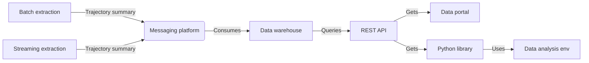

# GMN Data Platform
The master repository for the Global Meteor Network Data Platform. Clone and use this repository to get started.

To clone all sub-repositories use `./runme.sh`. 

It's recommended that you open each sub-repository in different PyCharm/VSCode projects. Setup each sub-repository according to each README.md file.

## Project Overview
TODO

## Sub-repositories
- [gmn-python-api](https://github.com/gmn-data-platform/gmn-python-api) - Python package for accessing Global Meteor Network data
- [gmn-data-store](https://github.com/gmn-data-platform/gmn-data-store) - Database models, controllers and scripts
- [gmn-data-store-ingestion](https://github.com/gmn-data-platform/gmn-data-store-ingestion) - Ingestion services for the GMN Data Store
- [gmn-data-endpoints](https://github.com/gmn-data-platform/gmn-data-endpoints) - Data portal and REST API
- [gmn-data-platform-monitoring](https://github.com/gmn-data-platform/gmn-data-platform-monitoring) - Monitoring services for the GMN Data Platform

## Technical Overview
Basic data flow diagram:

TODO

## Useful Links
- Full flow diagram - https://drive.google.com/file/d/1fIUpX8o0OkEjQTLUM0yUv6I7JUNNoXwY/view?usp=sharing
- Gantt chart - https://docs.google.com/spreadsheets/d/172i_P3JSHfCp8RU36-PSfdmqk0bwLmiMRhaUSwsOQHU/edit?usp=sharing
- Project board - https://github.com/orgs/gmn-data-platform/projects/1

## Related Repositories
- https://github.com/wmpg/WesternMeteorPyLib - Python meteor physics library developed by the Western Meteor Physics Group used to caculate trajectories currently on the GMN server.
- https://github.com/CroatianMeteorNetwork/RMS - Code for the Raspberry Pi Meteor Stations.
