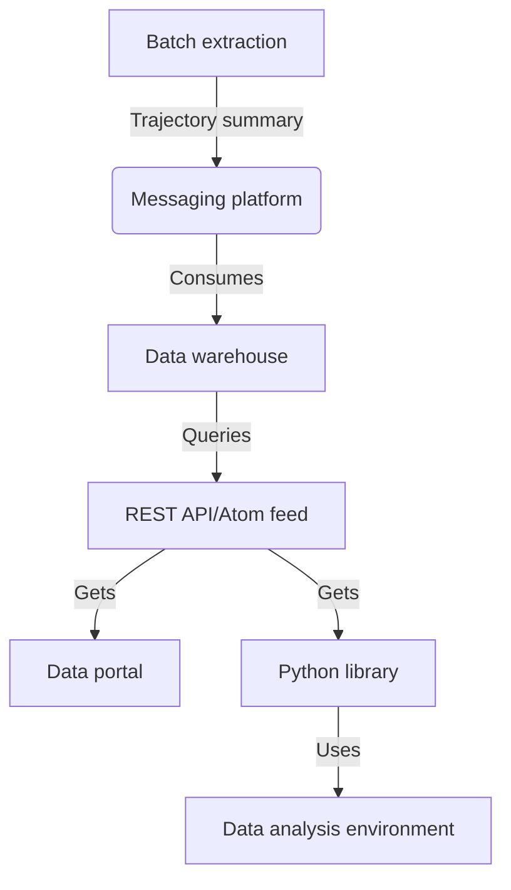

# GMN Data Platform
The master repository for the Global Meteor Network Data Platform. Clone and use this repository to get started.
 
To clone all sub-repositories use `./runme.sh`. 
 
It's recommended that you open each sub-repository in different PyCharm/VSCode projects. Setup each sub-repository according to each README.md file.
 
## Project Overview
The GMN Data Platform project provides a set of technologies to ingest, store and access [Global Meteor Network](https://globalmeteornetwork.org/) (GMN) data. Global meteor data is generated using a network of low-light cameras pointed towards the night sky. Meteor properties (radiants, orbits, magnitudes and masses) are produced by the GMN. The primary goal of the project is to allow open access GMN data to be accessed for further data analysis using [FAIR](https://www.go-fair.org/fair-principles/) principles. This project aims to be deployed on the GMN server.
 
Currently the GMN stores its meteor trajectory summary data in [CSV files](https://globalmeteornetwork.org/data/traj_summary_data/) (daily, monthly and total). Data stored in CSV files are difficult to query as all rows need to be walked over individually, data integrity is not ensured, and searching through the non-indexed data is slow. SQL databases provide a solution to these problems. Services that extract, transform and load daily GMN meteor trajectory data into a database from the CSV data directory in batches are provided. It is the intention that the data directory will no longer be produced and data will be streamed in real-time through the GMN Data Platform for data warehousing. A REST API is provided to users to query the data in the database using an SQL-like syntax. To support research, a data portal, data analysis environment and Python package are provided. Services for monitoring the internal data infrastructure are also provided.
 
## Sub-repositories
- [gmn-python-api](https://github.com/gmn-data-platform/gmn-python-api) - Python package for accessing Global Meteor Network data
- [gmn-data-store](https://github.com/gmn-data-platform/gmn-data-store) - Database models, controllers and scripts
- [gmn-data-store-ingestion](https://github.com/gmn-data-platform/gmn-data-store-ingestion) - Ingestion services for the GMN Data Store
- [gmn-data-endpoints](https://github.com/gmn-data-platform/gmn-data-endpoints) - Data portal, REST API and data analysis notebooks
- [gmn-data-platform-monitoring](https://github.com/gmn-data-platform/gmn-data-platform-monitoring) - Monitoring services for the GMN Data Platform
 
## Technical Overview
 
3 levels of data product:
- **Level one (support rapid follow-up phenomena data)**: A streaming platform for meteor trajectory summary data. Internal monitoring of messages, logs and system metrics are provided. Data is sent to the next level.
- **Level two (products that don’t need to be accessed in real-time)**: A relational SQL database of meteor trajectory data. Data is sent to the next level. 
- **Level three (contains data products that are user-facing)**: An external REST API for the SQL database, a Python package for querying using the REST API, a data portal web interface for viewing and querying data, and a Google Colab data analysis environment.
 
Basic data flow diagram:

 
Full data flow diagram:

- **Ingestion**: [Airflow](https://airflow.apache.org/) is a workflow management platform for data pipelines, it schedules and monitors daily data extraction tasks into [Kafka](https://kafka.apache.org/) of meteor trajectory summary files from the [GMN data directory](https://globalmeteornetwork.org/data/traj_summary_data/). This service uses the [gmn-python-api](https://github.com/gmn-data-platform/gmn-python-api) package to extract the last 10 days of produced trajectory summary daily CSV files at 1:00 every morning. Once extracted each row in each trajectory summary file is pushed to a Kafka broker in the topic `trajectory_summary_raw`. Another service consumes `trajectory_summary_raw` and updates a database.
- **Data warehousing**: A relational SQL database stores meteor trajectory summary data using [SQLite](https://www.sqlite.org/index.html). It is populated from the Kafka `trajectory_summary_raw` topic. The `gmn-data-store` Python package handles setting up, querying and updating data in the database.
- **Monitoring**: Logs, system metrics and Kafka messages are recorded by an [Elasticsearch](https://www.elastic.co/) cluster using [Metricbeat](https://www.elastic.co/beats/metricbeat). Data recorded can be visualised and monitored internally using [Kibana](https://www.elastic.co/kibana/). This is known as the [ELK stack](https://www.elastic.co/what-is/elk-stack).
- **REST API**: The REST API is provided by [Datasette](https://datasette.io/). It provides an interface to select data from a readonly restricted database using SQL-like queries.
- **Data portal**: Datasette also provides a web interface to view and query data stored in the database. The framework is extended to display a global meteor map when displaying any meteor data on the web interface.
- **Python package**: A Python package [gmn-python-api](https://github.com/gmn-data-platform/gmn-python-api) allows users to analysis GMN meteor data either from the legacy data directory or from the REST API. Data can be read into [Pandas](https://pandas.pydata.org/) DataFrames or [NumPy](https://numpy.org/) arrays. The current data schema for Kafka messages, database table schemas and Pandas DataFrames is also generated here.
- **Data analysis environment**: A [Google Colab](https://colab.research.google.com/?utm_source=scs-index) IPython [notebook](https://colab.research.google.com/github/gmn-data-platform/gmn-data-endpoints/blob/29f8c820bda950bf10d94e93c202857d73566e20/gmn_data_analysis_template.ipynb) provides a quick start template for data analysis work with GMN data using the `gmn-python-api`.
 
More detailed explanations of the services can be found in each of the sub-repositories.

## Data Infrastructure Setup
1. First clone the main `gmn-data-platform` repository and run the `runme.sh` script.
2. The `gmn-data-store` sub-repository should be initialised first using the Makefile to create the database and Docker volume.
3. The `gmn-data-platform-monitoring` sub-repository should be started using its Makefile now to begin monitoring logs from Docker containers.
4. Then `gmn-data-store-ingestion` and `gmn-data-endpoints` sub-repositories can be started up using there Makefiles.

## Useful Links
- Full flow diagram - https://drive.google.com/file/d/1FP-ho-klzpeyBU8T3U7ZVe92C1KyUgUa/view?usp=sharing
- Gantt chart - https://docs.google.com/spreadsheets/d/172i_P3JSHfCp8RU36-PSfdmqk0bwLmiMRhaUSwsOQHU/edit?usp=sharing
- Project board - https://github.com/orgs/gmn-data-platform/projects/1
 
## Related Repositories
- https://github.com/wmpg/WesternMeteorPyLib - Python meteor physics library developed by the Western Meteor Physics Group used to calculate trajectories currently on the GMN server.
- https://github.com/CroatianMeteorNetwork/RMS - Code for the Raspberry Pi Meteor Stations.
